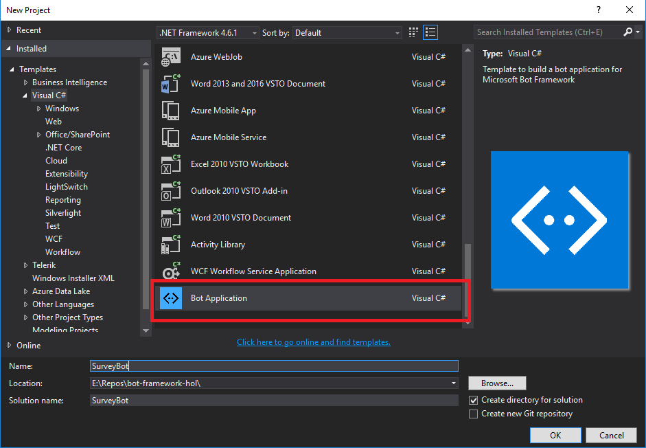
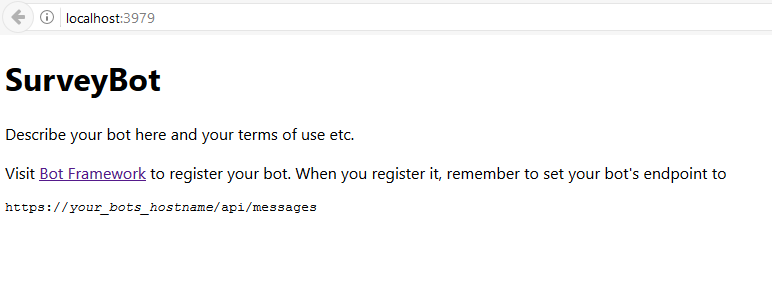
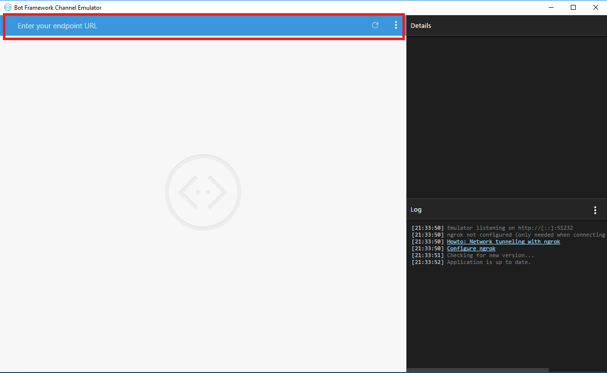
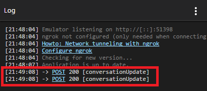

# Create a bot

In this first step, we are going to create our first bot

## Install prerequisite software

* Visual Studio 2015 (service pack 3) - you can download the community version here for free: [www.visualstudio.com](www.visualstudio.com)

    **Important:** Please update all VS extensions to their latest versions Tools->Extensions and Updates->Updates

* Download and install the Bot Application template
* Download the file from the direct download link [here](http://aka.ms/bf-bc-vstemplate)
* Save the zip file to your Visual Studio 2015 templates directory which is traditionally in **"%USERPROFILE%\Documents\Visual Studio 2015\Templates\ProjectTemplates\Visual C#\"**

## Create the Bot project

Open Visual Studio. Create a new C# project using the new Bot Application template.



If you look at the solution explore, you will see a lot of files

* AppStart/WebApiConfig.cs
    This file describe (and configure) your bot as an API, yes, a simple Web API.

* Controllers/MessagesController.cs
    This controller will contain the logical part of your bot.

Others file can be used for configuration but we'll not need them for our lab

## Trying the bot

Yes the bot is ready, not need to implement an "Hello World" because everything needed is here.
Run the project (F5)

Your browser should open the default.htm page and display the following message


Please note and keep the URL: **`http://localhost:3979/`** The port number may be different for you

## Discussing with the bot

The "bot" is ready but it is only an API, not the WebChat your were expecting, isn't it ?
The best way to test it is to use the Bot Emulator which will emulator a WebChat discussing. If not already done, [download](https://emulator.botframework.com/) and install it.

Once you run it, an almost empty interface will be shown


In the URL textbox, type the URL of your api and **append /api/messages** and them type Enter
Ignore the connection credentials. You don't require them until you register your bot on the Microsoft portal.

If the connection with the bot is successful, you should see POST 200 messages, which means that a message has been transmitted successfully to the API



Type *"hello"* to the bot, and it should answer to you *"You sent hello which was 5 characters"*

Your bot is working!
Let's take a look at the code in the MessageController.cs. There is only one public method **Post**
This message receive all messages sent to the bot. The messages, called *Activities* can be of several types

ActivityType | Interface | Description
------------ | ------------- | -------------
message | IMessageActivity | a simple communication between a user <-> bot
conversationUpdate | IConversationUpdateActivity | your bot was added to a conversation or other conversation metadata changed
contactRelationUpdate | IContactRelationUpdateActivity | The bot was added to or removed from a user's contact list
typing | ITypingActivity | The user or bot on the other end of the conversation is typing
ping | n/a | an activity sent to test the security of a bot.
deleteUserData | n/a | A user has requested for the bot to delete any profile / user data

But only the message type is interesting for us in our lab. If we look at the code, we can see that we have a specify IF statement to perform specific actions whenever a message is received.

```csharp
 public async Task<HttpResponseMessage> Post([FromBody]Activity activity)
        {
            if (activity.Type == ActivityTypes.Message)
            {
                ConnectorClient connector = new ConnectorClient(new Uri(activity.ServiceUrl));
                // calculate something for us to return
                int length = (activity.Text ?? string.Empty).Length;

                // return our reply to the user
                Activity reply = activity.CreateReply($"You sent {activity.Text} which was {length} characters");
                await connector.Conversations.ReplyToActivityAsync(reply);
            }
            ...
        }
```

You can easily change it with any other message you want, or even add some *dynamicity* to have a more "human" exchange

```csharp
if (activity.Type == ActivityTypes.Message)
{
    ConnectorClient connector = new ConnectorClient(new Uri(activity.ServiceUrl));
    Activity reply = null;
    // calculate something for us to return
    int length = (activity.Text ?? string.Empty).Length;

    if (activity.Text.Contains("hello"))
    {
        reply = activity.CreateReply($"Hello to you human :)");
    }
    else
    {
        // return our reply to the user
        reply = activity.CreateReply($"You sent {activity.Text} which was {length} characters");
    }
    await connector.Conversations.ReplyToActivityAsync(reply);
}
```

That's not bad but clearly not efficient to build a full conversation. That's not the point of this lab and you should look after langage recognition ([L.U.I.S](https://www.luis.ai/)) and the [dialogs](https://docs.botframework.com/en-us/csharp/builder/sdkreference/dialogs.html) of bot framework if you want to go further.
Let's go the [second part](../Part 2/README.md) of the lab.