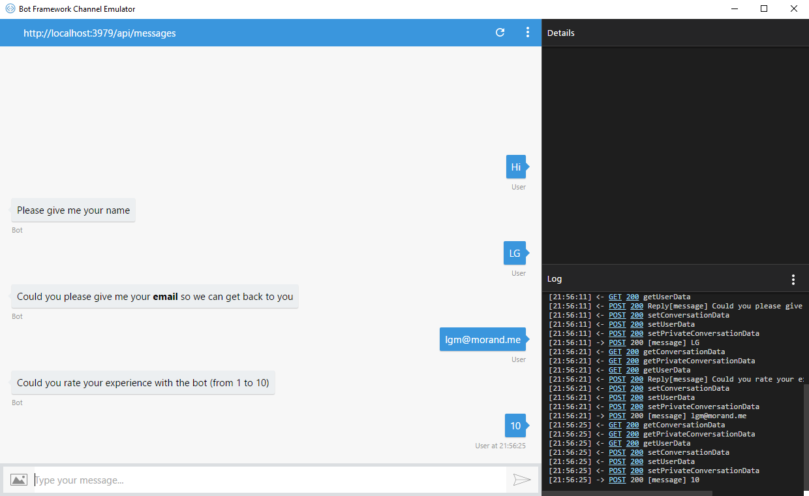

# Implement a survey discussion

If the [first part](../Part 1/README.md), you set a fully working bot but it is not very *smart*. Our objective is to use our bot to ask a set of questions to the users and register the relative answers.

If we had to do it with a console application, we would have to write the code to perform the following process:

1. Initialize the survey
1. Ask the first question
1. Register the answer
1. Ask the next question
1. Register the answer
1. repeat...

Fortunatly, the bot framework brings us an helper to do that very quickly: it's called [FormFlow](https://docs.botframework.com/en-us/csharp/builder/sdkreference/forms.html).
> Dialogs are very powerful and flexible, but handling a guided conversation like ordering a sandwich can require a lot of effort. At each point in the dialog, there are many possibilities for what happens next. You may need to clarify an ambiguity, provide help, go back or show progress so far. In order to simplify building guided conversations the framework provides a powerful dialog building block known as FormFlow. FormFlow sacrifices some of the flexibility provided by dialogs, but in a way that requires much less effort.

## Create our survey object

The baseline of FormFlow is to use a POCO class as an asset to build the conversation but also as the output artefact to contain the data retrieved dugin the discussion.
Let's create a class file **Survey.cs**

```` csharp
[Serializable]
    public class Survey
    {
        public static IForm<Survey> BuildForm()
        {
            return new FormBuilder<Survey>()
                    .Build();
        }

        public string Name;

        public string Mark;

        public string Email;

    }
````

This class contains three properties and a static method which must return an _IForm<T>_ object. This object will serve the bot and be parsed sequentially to build the dialog which means that the bot will sequentially ask the user for each member.

## Build the conversation with the user

When you run your bot, it will ask

1. Please type name
1. Please type mark
1. Please type email

## Improve the user experience

The bot is perfectly working but not very user friendly. First, the order of the questions is not logical and furthermore the questions are a little bit too robotic. Let's change that.

If we take a look at the FormBuilder(), we see two methods:

```` csharp
return new FormBuilder<Survey>() // the construstor
                    .Build(); // the method to build the final object for the bot
````

The fact is that the Build() method will parse sequentially all the public members, but not really in the order we want. What we can do is to specified the order of the fields by "calling" them with the Field method:

```` csharp
return new FormBuilder<Survey>() // the construstor
                    .Field("Name")
                    .Field("Email")
                    .Field("Mark")
                    .Build(); // the method to build the final object for the bot
````

If you just want to specify some members and then let the bot finish with the others, you can use the AddRemainingFields() method.

```` csharp
return new FormBuilder<Survey>() // the construstor
                    .Field("Name")
                    .Field("Email")
                    .AddRemainingFieldsField() // will add the "Mark" field
                    .Build(); // the method to build the final object for the bot
````

Now, let's specify how the bot will prompt the user to retrieve the infos

```` csharp
[Prompt("Please give me your name")] // specify the sentence sent to the user
public string Name;

[Pattern(@"^\w+([\.+_])*\w+@\w+(\.\w+)+$")] // specify a regex to valid the property
[Template(TemplateUsage.NotUnderstood, "\"{0}\" does not seem to be a valid email.")] // specify the sentence sent back to the user in case the pattern is not validated
[Prompt("Could you please give me your **email** so we can get back to you")] // specify the sentence sent to the user
public string Email;

[Numeric(1, 10)] // specif the range of valid values for the property
[Prompt("Could you rate your experience with the bot (from 1 to 10)")] // specify the sentence sent to the user
public string Mark;
````

Compile and try again your bot, it should be more _sexy_ to use



Now that the bot is working, let's publish it on Internet. Go the [third part](../Part 3/README.md).