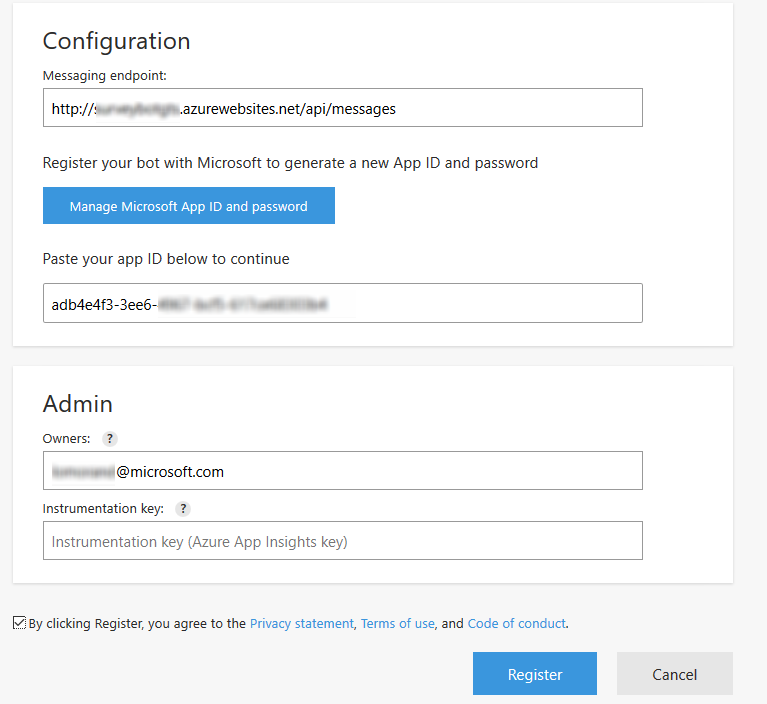

# Deploy the bot

Now that we finished our first version of our bot in the [part two](Part 2/README.md), bot which only works locally with the bot emulator, it's time to test it in real conditions. For that we are going to publish it Azure.

In Visual Studio, right clicking on the project in Solution Explorer and select "Publish" - or alternately selecting "Build | Publish" displays the following dialog:


The Publish to Azure wizard will start. For this tutorial you will need to select "Microsoft Azure App Service" as your project type.


The next step in the Azure App Service publishing process is to create your App Service. Click on "New…" on the right side of the dialog to create the App Service.


> The Create App Service dialog will be displayed, fill in the details as appropriate. Make sure to choose "Web App" from the Change Type drop down in the top right instead of "API App"(which is the default).

Once you hit okay on the App Service Plan, you'll have defined your App Service completely. Hit Create, and you'll be taken back to the Publish Web Wizard.


Now that you've returned to the Publish Web wizard copy the destination URL to the clipboard, you'll need it in a few moments. Hit "Validate Connection" to ensure the configuration is good, and if all goes well, click "Next". And then, in the new screen, click "Publish"


You will see a number of messages displayed in the Visual Studio "Output" window. Once publishing is complete you will also see the web page for your Bot Application displayed in your browser (the browser will launch, and render your Bot Application HTML page), see below.


you can test you bot URL in a browser, you should see a "home" web page, which is the default.htm file in your solution.

## Register the bot

It's time to register our bot to get integration.

1. Go to the Microsoft Bot Framework portal at [https://dev.botframework.com](https://dev.botframework.com)and sign in with your Microsoft Account.
1. Click the "Register a Bot" button and fill out the form. Many of the fields on this form can be changed later. Use a the endpoint generated from your Azure deployment, and don't forget that when using the Bot Application tempalate you'll need to extend the URL you pasted in with the path to the endpoint at /API/Messages. You should also prefix your URL with HTTPS instead of HTTP; Azure will take care of providing HTTPS support on your bot.
1. Save your changes by hitting "Create" at the bottom of the form.


Once your registration is created, Microsoft Bot Framework will take you through generating your MicrosoftAppId and MicrosoftAppPassword. These are used to authenticate your Bot with the Microsoft Bot Framework.
> NOTE: When you generate your MicrosoftAppPassword, be sure to record it somewhere as you won't be able to see it again.


Now, register your bot. Until you publish it, it will not be listed in the bots directory



Once registered, you can access the dashboard of your bot when you can

1. Test the connection to your bot
1. Test the communication with your bot through a web chat
1. Add or remove channels to your bot. This way, you can decide in which ways users can communicate with your bot


Now that the Bot is registered, you need to update the keys in the web.config file in your Visual Studio project. Change the following keys in the web.config file to match the ones generated when you saved your registration, and you're ready to build. Clicking the "show" link will show the value, along wtih exposing the regenerate link if you ever need to change your AppPassword. Update your web.config, and **re-publish your bot to Azure**.

```` csharp
  <appSettings>
    <!-- update these with your BotId, Microsoft App Id and your Microsoft App Password-->
    <add key="BotId" value="SurveyBot" />
    <add key="MicrosoftAppId" value="adb4e4f3-3ee6-4967-xxxx-xxxxxxx" />
    <add key="MicrosoftAppPassword" value="j7txxxxxxxxxxxxx" />
  </appSettings>
````

## Host a webchat

There is several to interact with a bot, either throught a WebChat, a skype chat, custom app, etc. The simple way to do it, and probably the most common usage of bot, is to integrate a webchat in a website.
Go back to the [bot portal](https://dev.botframework.com/) and in the dashboard of your bot, edit the **Web Chat** configuration. Add a site by giving a nickname.


Then copy paste the HTML code with the ifram and copy paste it in the default.html file of your Visual Studio solution. Then publish again. You can now test your bot and share it with users.


Now that the bot is deployed, let's improve it by storing the data in a database. Go the [fourth part](../Part 4/README.md).