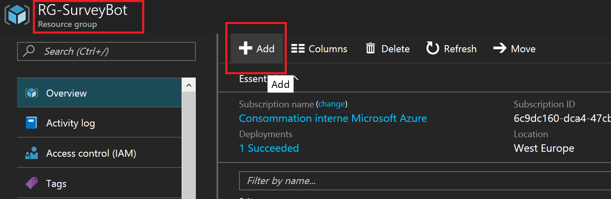
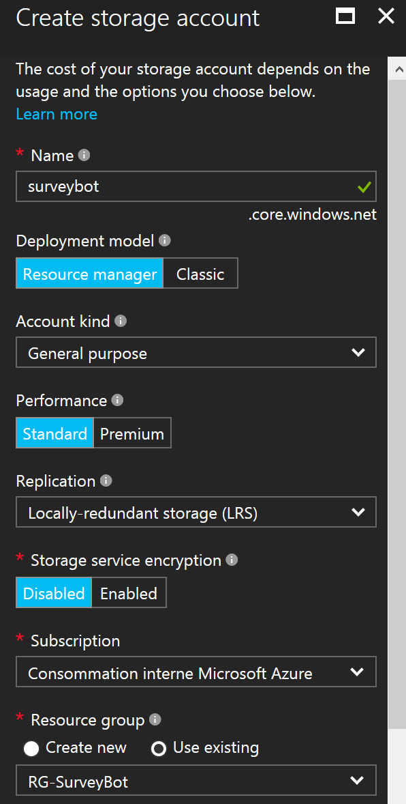
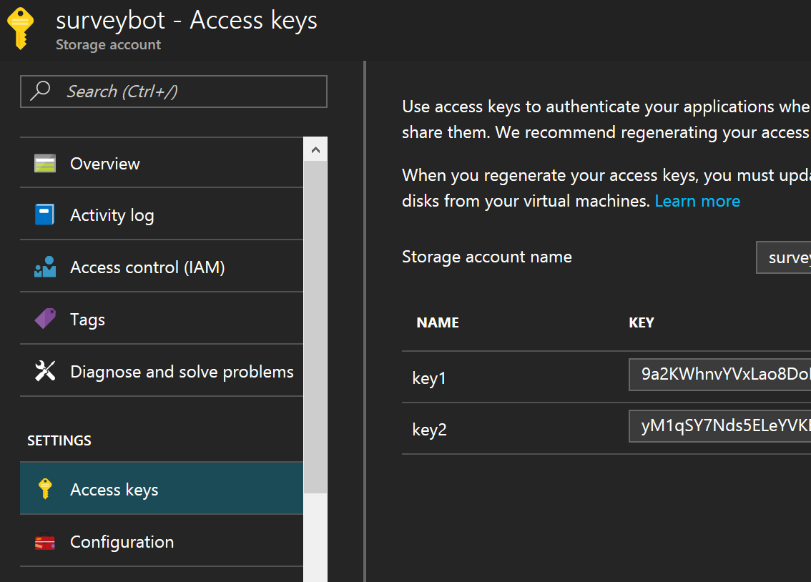
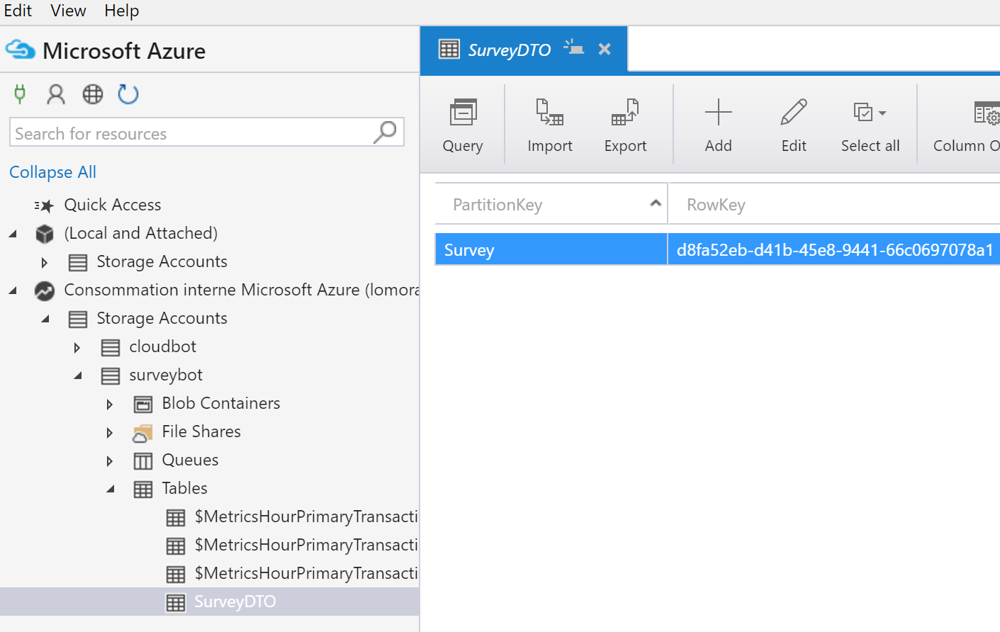

# Store the survey's data

Now that we have a fully fonctional survey assistant, it's important for us to store the data somewhere. You could store the data wherever you want but for the lab, we are going to store it in Azure Table Storage.

## Create a storage account in Azure

Connect to the [Azure Portal](http://portal.azure.com/), and log in with an account with an active subscription. If required, don't hesitate to create a free account. You'll have to give a valid credit card but nothing will be taken from your bank account. Instead, you can even have a free 170$ budget, which is way enough for dozen of bots and we need only one.

On the Azure portal, find the previously created resource group and **Add** a storage account



Create a standard storage account, with LRS and no encryption (you don't need server-side encryption in the lab but it could be useful in production environment)



Find the keys to access your storage and copy the first one to the clipboard



Now, register a connection string inside the web.config file of your Visual Studio project.

```` xml
<connectionStrings>
    <add name="StorageConnectionString" connectionString="DefaultEndpointsProtocol=https;AccountName=SurveyBot;AccountKey=4nCEgPyGqYELzj4Ec6qsSttayhi8+vSQz7JR1qZwa7jpP/wlgmorandJP4mLollgmorandYrDjduCobhVr5ePKRxQ==;" />
</connectionStrings>
````

## Upgrade the project

Go in Visual Studio, and manage the nuget packages of your solution. Upgrade all packages you can, especially the Microsoft.Bob.Framework. If some of them are incompatible, it's ok, it's just to ensure to have the last version of the SDK

Install the following nuget

* WindowsAzure.Storage
* WindowsAzure.StorageExtensions

With this two packages, it now possible to create a simple helper to store our object into the table storage. For that we use a DTO, which is mainly done to reduce footprint but also to simplify the code by heriting TableEntity (which will auto-generate columns in Table Storage)

```` csharp
public class StorageHelper
{
    CloudStorageAccount storageAccount = null;
    CloudTableClient tableClient;
    TableSet<SurveyDTO> assessmentsTable;

    public StorageHelper()
    {
        storageAccount = CloudStorageAccount.Parse(ConfigurationManager.ConnectionStrings["StorageConnectionString"].ConnectionString);

        // we ensure that we create the Table if not already present
        assessmentsTable = new TableSet<SurveyDTO>(storageAccount.CreateCloudTableClient());
        assessmentsTable.CreateIfNotExists();
    }

    public void StoreSurvey(SurveyDTO survey)
    {
        // we store our survey as a new record
        assessmentsTable.AddOrUpdate(survey);
    }
}
````

You then have to create your DTO as following

```` csharp
public sealed class SurveyDTO : TableEntity
{
    [PartitionKey]
    public string Partition = "Survey";

    [RowKey]
    [Property("email")]
    public string Email;
}

public static class Extensions
{
    public static SurveyDTO ConvertToDTO(this Survey survey)
    {
        SurveyDTO dto = new SurveyDTO();
        dto.Email = survey.Email;
        // map each property you want to store in database
        return dto;
    }
}
````

Finally, we have to tell our FormFlow to call a specific delegate once the conversation is done. This delegate will then call our helper

```` csharp
public static IForm<Survey> BuildForm()
{
    OnCompletionAsyncDelegate<Survey> processSurvey = async (context, state) =>
    {
        // we store the data in Table storage
        new StorageHelper().StoreSurvey(state.ConvertToDTO());
        await context.PostAsync("Thanks! The survey is done. We registered your information and will get back to you as soon as possible.");
    };

    return new FormBuilder<Survey>()
            //.Message("Welcome to the quick survey! Let's ask you some questions")
            .AddRemainingFields()
            .OnCompletion(processSurvey)
            .Build();
}
````

Run your bot (publish it to Azure) and test it. When you finish to fill a survey, you should be able to run Azure Storage Explorer and to see your data in a table.



Kind of simple to have a bot and storing the data isn't it ? Now, we can consume the data in different ways but the simple one is to build a PowerBI report. Go the [fifth part](../Part 5/README.md).