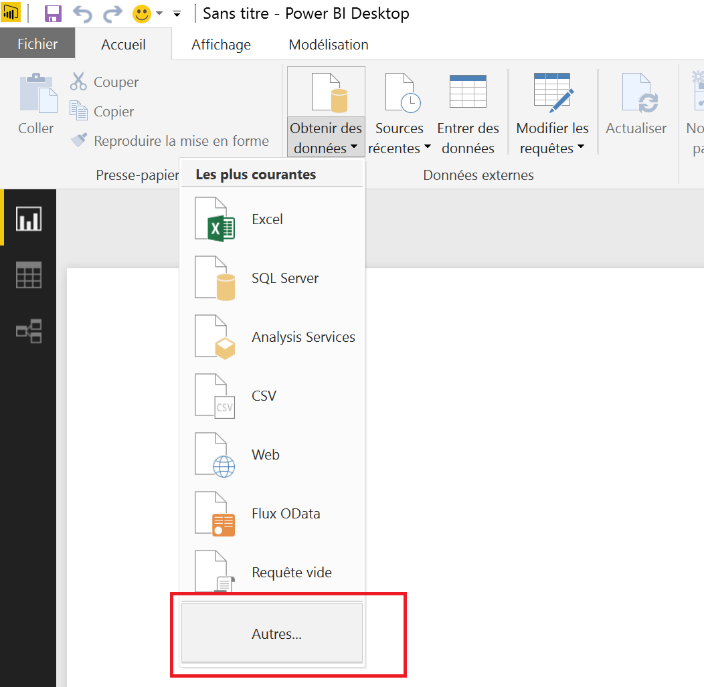
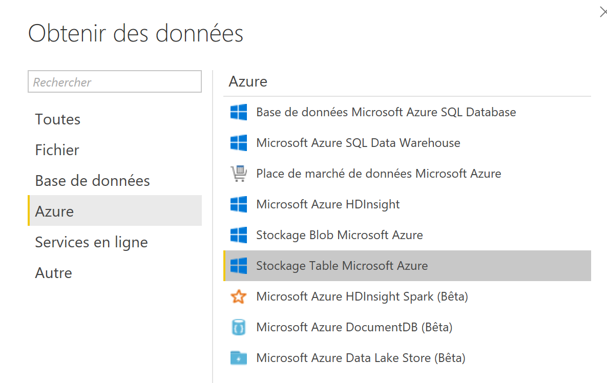
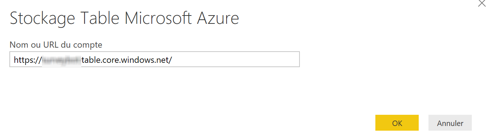
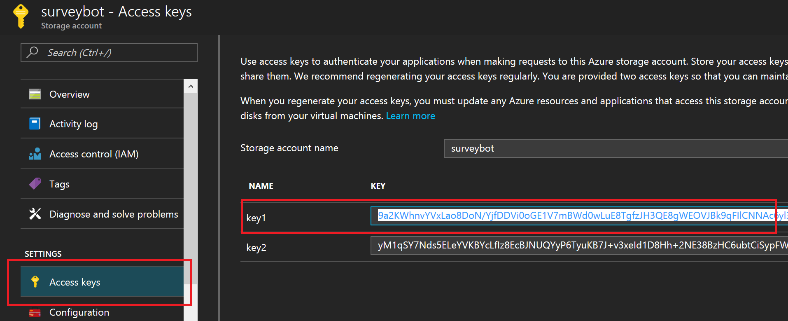
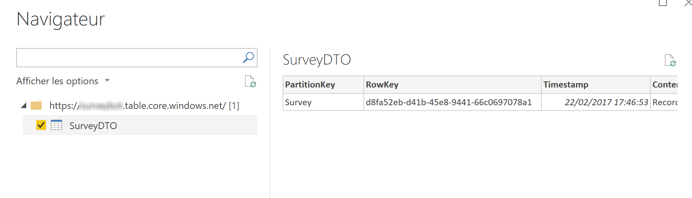
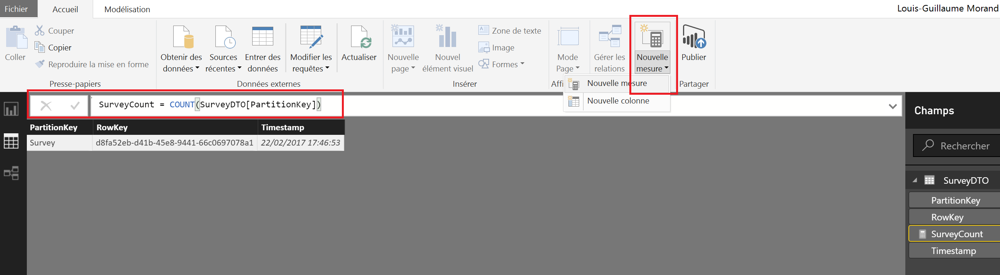
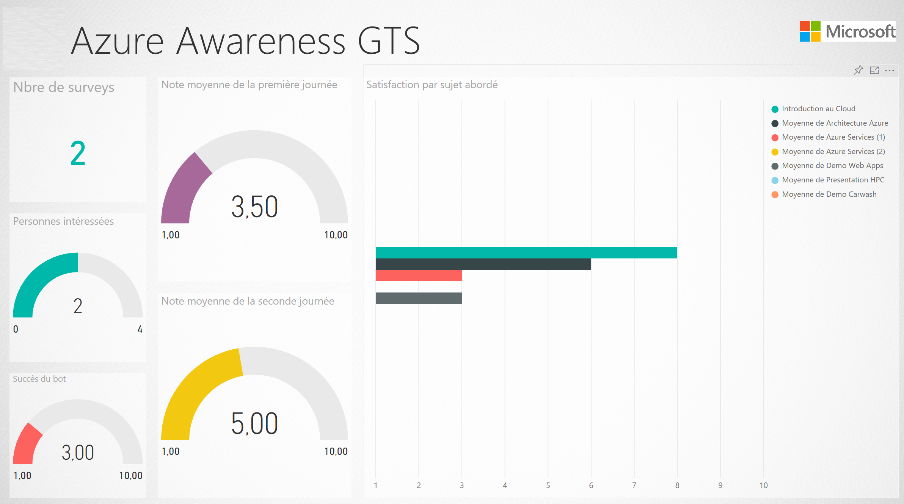

# Build a report

Once we can register our data in our "database", it's time to consume it and to build a report. We could easily develop an application or a Web Page reading data using Azure SDK, but to do it more easily and more quickly, let's use PowerBI.
[Power BI](https://powerbi.microsoft.com) is a suite of business analytics tools to analyze data and share insights. Monitor your business and get answers quickly with rich dashboards available on every device.

If it's not already done, please download the PowerBI Desktop client ([here](https://powerbi.microsoft.com/fr-fr/desktop))

## Create your report

Open PowerBI Desktop and open the menu **File > New**. We have to add a source, choose **Get data > Others**

Select **Azure > Table storage**

Type the URL to your table, URL that you can find on the Azure Portal and one one the two access keys available.

I hope in the future, it would be possible to access data with a SAS key, to restrict access to read only/

Select the table and you can preview the available "columns" which will be usable in your report

## Design the report

You can now place charts and map them to your data. If you want specific value, like calculated values, you can add them in the data source screen

We'll not go into details to create the report because it will depend on your needs but you can find a lot of help on PowerBI on the official WebSite.

This lab is finished!

## To go further

Add natural langage to your chatbot: [https://docs.botframework.com/en-us/node/builder/guides/understanding-natural-language/](https://docs.botframework.com/en-us/node/builder/guides/understanding-natural-language/)